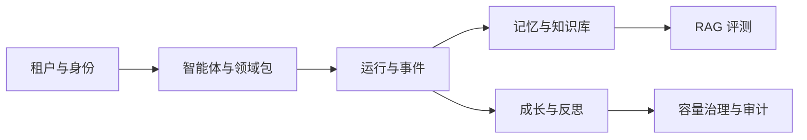
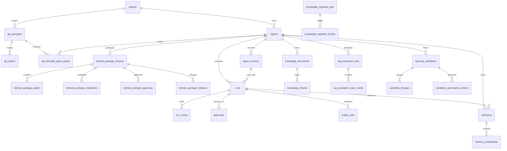

# Public Agent 数据库表结构

本文档是数据库结构的阅读入口，描述当前生产 Schema 的分层、主要表、关键关系和迁移方式。

## 1. 事实来源与版本

数据库结构的唯一事实来源是 Alembic 迁移，不是手写 `init.sql`：

- 初始生产 Schema：`migrations/versions/edf6648c8894_initial_production_schema.py`
- 增量变更：`migrations/versions/*.py`
- SQLAlchemy ORM 映射：`src/public_agent/storage/models.py`
- 当前目标版本：执行 `alembic heads` 查看，部署使用 `alembic upgrade head`

迁移具备可回滚链路，禁止在生产环境手工建表、删表或绕过迁移版本。

## 2. 逻辑分层



## 3. 核心关系图



治理审计表均通过 `tenant_id` 和对应资源 ID 关联，数据库约束保证租户边界。

## 4. 表清单

除特别说明外，各表主键均为 PostgreSQL `uuid`，带时间戳的业务表包含 `created_at`、`updated_at`。

### 4.1 租户、身份与权限

| 表 | 主要字段 | 作用 |
|---|---|---|
| `tenants` | `id`, `slug`, `name`, `active` | 租户根实体；`slug` 唯一 |
| `api_principals` | `id`, `tenant_id`, `subject`, `status`, `permissions`, `all_agents` | API 主体、权限集合和租户作用域 |
| `api_principal_agent_grants` | `principal_id`, `agent_id`, `tenant_id` | 主体到智能体的显式授权；复合主键 |
| `api_tokens` | `id`, `principal_id`, `tenant_id`, `prefix`, `secret_digest`, `expires_at`, `revoked_at` | Bearer Token 摘要；不保存明文 Token |
| `authentication_audit_events` | `id`, `tenant_id`, `actor_principal_id`, `action`, `outcome` | 认证和身份管理追加式审计 |

### 4.2 智能体、版本与领域能力包

| 表 | 主要字段 | 作用 |
|---|---|---|
| `agents` | `id`, `tenant_id`, `agent_key`, `name`, `domain_id`, `active_version_id` | 智能体稳定身份；租户内 `agent_key` 唯一 |
| `agent_versions` | `id`, `tenant_id`, `agent_id`, `version`, `instructions`, `memory_namespace`, `configuration` | 可恢复、可审计的运行版本 |
| `domain_package_versions` | `id`, `tenant_id`, `agent_id`, `domain_id`, `version`, `content_hash`, `status` | 专业领域包版本和生命周期 |
| `domain_package_assets` | `id`, `package_version_id`, `asset_type`, `asset_key`, `relative_path`, `content_hash`, `content` | instruction、policy、workflow、evaluation 资产 |
| `domain_package_evaluations` | `id`, `package_version_id`, `status`, `score`, `evidence` | 领域包评测结果 |
| `domain_package_approvals` | `id`, `package_version_id`, `decision`, `reviewer`, `reason` | 领域包审批记录 |
| `domain_package_releases` | `id`, `package_version_id`, `released_agent_version_id`, `previous_agent_version_id` | 领域包发布、回滚和幂等事实 |

### 4.3 运行时、审批与 Outbox

| 表 | 主要字段 | 作用 |
|---|---|---|
| `runs` | `id`, `tenant_id`, `agent_id`, `agent_version_id`, `status`, `input`, `output` | 一次智能体运行主记录 |
| `run_events` | `id`, `tenant_id`, `run_id`, `sequence`, `event_type`, `payload` | 不可变、有序运行轨迹 |
| `approvals` | `id`, `tenant_id`, `run_id`, `learning_candidate_id`, `status`, `resume_token_hash` | 高风险工具调用的暂停、批准和恢复 |
| `outbox_jobs` | `id`, `tenant_id`, `run_id`, `job_type`, `status`, `attempts`, `lease_expires_at` | 反思、异步处理和可靠投递队列 |
| `outbox_job_archives` | `id`, `source_job_id`, `archived_at`, `payload` | Outbox 历史归档；按时间范围分区 |

### 4.4 记忆、知识库与 RAG

| 表 | 主要字段 | 作用 |
|---|---|---|
| `memories` | `id`, `tenant_id`, `agent_id`, `run_id`, `kind`, `content`, `fingerprint`, `status` | 运行经验、偏好和沉淀记忆 |
| `memory_embeddings` | `id`, `tenant_id`, `memory_id`, `embedding` | 记忆向量；pgvector |
| `knowledge_documents` | `id`, `tenant_id`, `agent_id`, `source_uri`, `content_hash`, `parser_profile`, `status` | 上传文档及解析元数据 |
| `knowledge_ingestion_jobs` | `id`, `tenant_id`, `agent_id`, `document_id`, `status`, `error_code` | 文档摄取任务状态机 |
| `knowledge_ingestion_chunks` | `id`, `ingestion_job_id`, `ordinal`, `content`, `metadata` | 摄取过程临时分块 |
| `knowledge_chunks` | `id`, `tenant_id`, `agent_id`, `document_id`, `content`, `search_vector`, `embedding` | FTS + pgvector 混合检索知识块 |
| `rag_evaluation_runs` | `id`, `tenant_id`, `agent_id`, `dataset`, `status`, `metrics` | 一次 RAG 评测运行 |
| `rag_evaluation_case_results` | `id`, `rag_evaluation_run_id`, `case_id`, `retrieved_ids`, `scores`, `evidence` | 单案例召回、重排和答案证据 |

### 4.5 反思、成长与候选治理

| 表 | 主要字段 | 作用 |
|---|---|---|
| `learning_candidates` | `id`, `tenant_id`, `agent_id`, `candidate_type`, `content`, `fingerprint`, `status` | 从运行轨迹提取的成长候选 |
| `candidate_lineages` | `candidate_id`, `parent_candidate_id`, `relation` | 候选来源、合并和派生关系 |
| `candidate_governance_actions` | `id`, `candidate_id`, `action`, `actor`, `reason` | 候选评测、批准、激活、废弃、回滚 |
| `evaluations` | `id`, `tenant_id`, `candidate_id`, `evaluator`, `score`, `evidence` | 候选质量评测 |
| `reflection_capacity_observations` | `id`, `job_type`, `handler_version`, `observed_at`, `ready`, `processing`, `active_workers` | Worker 运行容量观测；按任务类型和处理器版本归档 |
| `reflection_capacity_calibrations` | `id`, `job_type`, `handler_version`, `sample_count`, `p95_processing_ms`, `recommended_workers` | 基于真实负载的容量校准 |
| `reflection_capacity_policies` | `id`, `job_type`, `handler_version`, `policy_version`, `thresholds`, `status` | 版本化容量策略；同一处理器仅允许一个 active 版本 |
| `reflection_capacity_change_requests` | `id`, `job_type`, `handler_version`, `status`, `calibration_id`, `base_policy_id` | 容量策略申请、审批、发布和回滚 |
| `reflection_capacity_governance_alerts` | `id`, `job_type`, `handler_version`, `dedupe_key`, `severity`, `status` | 策略漂移和容量告警 |
| `reflection_capacity_governance_incidents` | `id`, `tenant_id`, `alert_id`, `status`, `detected_at`, `resolved_at` | 告警升级后的治理事件 |
| `reflection_capacity_governance_remediations` | `id`, `incident_id`, `status`, `plan`, `verification` | 受控整改计划和验证证据 |
| `reflection_capacity_governance_postmortems` | `id`, `incident_id`, `remediation_id`, `status`, `findings` | 事件复盘和知识发布输入 |
| `reflection_capacity_governance_knowledge_feedback` | `id`, `postmortem_id`, `feedback_type`, `status`, `content` | 复盘知识反馈、隔离和审核 |
| `reflection_capacity_governance_knowledge_quality_snapshots` | `id`, `postmortem_id`, `captured_at`, `quality_score`, `risk_level` | 知识质量快照和趋势 |
| `reflection_capacity_governance_knowledge_recoveries` | `id`, `postmortem_id`, `status`, `restored_version`, `evidence` | 知识恢复、回滚和验证 |
| `reflection_capacity_governance_audit_events` | `id`, `tenant_id`, `action`, `outcome`, `actor_subject` | 容量治理全链路追加式审计 |
| `reflection_job_retry_requests` | `id`, `tenant_id`, `job_id`, `status`, `requested_by` | Dead-letter 任务人工重试请求 |
| `reflection_job_operation_audit_events` | `id`, `tenant_id`, `job_id`, `operation`, `outcome` | 反思任务运维操作审计 |
| `reflection_worker_heartbeats` | `id`, `tenant_id`, `worker_id`, `observed_at`, `status`, `job_id` | Worker 存活和租约观测 |

## 5. 关键数据库约束

- 租户域业务资源携带 `tenant_id`；跨租户关联由复合外键在数据库层拒绝。容量观测、校准、策略、变更请求和漂移告警属于按 `job_type + handler_version` 管理的全局控制面；升级后的事件、整改、复盘、知识和审计记录再绑定 `tenant_id`。
- 运行事件、治理审计和认证审计采用 append-only 约束和数据库触发器保护。
- Token 仅保存 `secret_digest`，并通过长度约束保证为 32 字节摘要。
- 知识块同时保存 `tsvector` 全文索引字段和 pgvector embedding；RAG 结果只能作为 advisory 证据。
- 候选使用作用域指纹和唯一索引去重，冲突合并保留 lineage，不覆盖原始候选。
- Outbox 归档表按时间范围分区；清理前必须存在精确归档并通过保留策略检查。

## 6. 初始化与查看

### Docker Compose（开发）

```powershell
Copy-Item .env.example .env
docker compose up -d postgres
alembic upgrade head
```

### Docker Compose（生产）

```powershell
docker compose -f docker-compose.production.yml up -d postgres migrate
```

### 查看表和字段

```powershell
docker compose exec postgres psql -U public_agent -d public_agent -c "\dt"
docker compose exec postgres psql -U public_agent -d public_agent -c "\d+ knowledge_chunks"
```

### 导出当前版本 SQL（仅用于审阅）

```powershell
alembic upgrade head --sql > schema.sql
```

`schema.sql` 是审阅产物，不应替代迁移文件，也不应提交包含生产数据的数据库 dump。

## 7. 变更流程

1. 创建新的 Alembic revision，并在预发布 PostgreSQL 上执行 `alembic upgrade head`。
2. 运行 PostgreSQL 集成测试、`alembic check` 和生产门禁。
3. 发布应用镜像与迁移；生产编排中的 `migrate` 服务先于 API/Worker 完成。
4. 需要回滚时按 ADR 和运维手册指定 revision 回退，禁止直接修改历史 migration。
