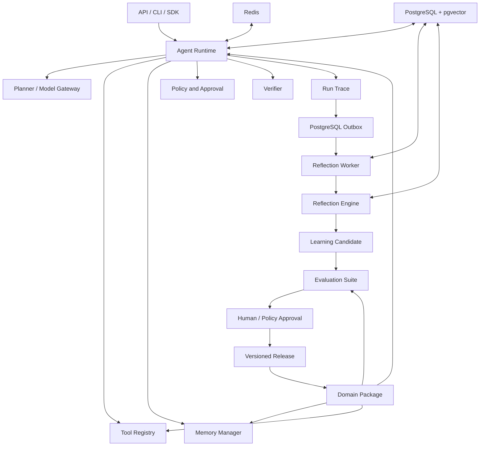

# public_agent 技术方案

- 文档版本：0.22
- 状态：已实现 RBAC 审批控制台、策略漂移检测与治理告警闭环
- 日期：2026-08-25

## 1. 项目目标

构建一个生产级通用智能体基础设施。通用内核负责理解任务、规划、调用工具、管理记忆、验证结果和记录轨迹；领域能力包负责定义专业知识、专业工具、标准流程、权限规则、案例和评测标准。

最终系统应能够快速生成合同审查、客服、财税、软件开发等专业智能体，并通过运行反馈持续形成成长候选。所有成长必须经过评测、审批、发布和回滚流程。

## 2. 成功标准

1. 同一个运行内核能够加载不同领域能力包，且领域记忆互不污染。
2. 智能体能够完成“模型决策 → 工具调用 → 环境反馈 → 结果验证”的闭环。
3. 运行过程能够暂停等待人工审批，并从保存状态继续。
4. 任务经验能够形成成长候选，但不能未经验证直接修改正式能力。
5. 记忆、技能、领域包和智能体配置均支持版本、审计和回滚。
6. PostgreSQL、pgvector、Redis、迁移、日志、健康检查和测试满足生产基线。

## 3. 范围

### 3.1 v0.1 范围

- Python 异步运行内核。
- 模型供应商抽象接口和测试模型实现。
- 领域能力包定义、加载和版本校验。
- 工具注册、参数验证、超时、风险等级和审批判断。
- 工作记忆与长期记忆接口。
- PostgreSQL + pgvector 数据模型和 Alembic 迁移。
- 运行事件、成长候选、评测、审批、发布与回滚状态模型。
- FastAPI 健康检查和基础管理接口。
- 离线单元测试与数据库集成测试边界。

### 3.2 暂不实现

- 自动生成并安装任意代码工具。
- 未经审批的在线自我修改。
- 模型参数微调流水线。
- 独立向量数据库和知识图谱数据库。
- 微服务拆分和 Kubernetes 编排。
- 面向最终用户的 Web 管理界面。

## 4. 总体架构



系统采用模块化单体。模块通过明确接口交互，禁止跨模块直接访问内部实现。未来只有在独立扩容、合规或团队边界明确时才拆分服务。

## 5. 双循环模型

### 5.0 当前落地状态

知识沉淀纵向切片已经打通：`PersistentAgentService` 创建运行记录，
`PostgresRunEventSink` 顺序追加运行事件，`KnowledgeSedimentationPipeline` 在成功运行后生成并评测候选，
`PostgresKnowledgeAssetPublisher` 在显式审批后以单事务写入审批记录、正式记忆并激活候选。
运行时会记录 `memory.recalled` 事件；回滚会在同一事务中将候选标记为 `rolled_back`、
将正式记忆标记为 `superseded`。

完整轨迹反思已经落地：运行时将助手正文和 JSON 安全的工具结果写入不可变事件，
`PostgresRunPersistence.load_trace` 按租户、智能体和版本加载严格有序轨迹，
`ReflectionEngine` 在秘密脱敏和容量控制后调用反思模型。模型必须返回严格 JSON，
每个知识项必须引用本次实际呈现的事件 ID；缺失、伪造或裁剪范围外的证据会使整次反思失败。
失败运行可以提出 `failure` 记忆。所有结果仍只进入候选、评测和人工审批，绝不自动发布。

反思审计复用 `run_events`、`outbox_jobs` 与候选 `proposed_change`，记录证据事件 ID、理由、标签、适用范围、
反思引擎和 Prompt 版本。运行进入成功、失败、取消或超时终态时，`PostgresRunPersistence` 在同一事务中
幂等写入反思任务；Worker 只读取安全 schema 版本并按 run ID 重载已提交轨迹，不在 Outbox payload 复制
task、output、checkpoint、provider state 或凭据。

候选冲突治理已经落地：`learning_candidates.fingerprint` 是 PostgreSQL 独立权威列，
`tenant_id + agent_id + domain_id + fingerprint + status` 非唯一索引服务精确查询，JSON 副本仅保留兼容审计。
同指纹创建通过事务级 advisory lock 保证并发幂等，同时继续允许 `rejected` 和 `rolled_back` 后重新提出。
默认规则检测器保守地区分 `duplicate`、`compatible`、`contradictory` 和 `none`；沉淀阶段只记录评估，
显式合并才创建新的候选。合并候选完整保存来源候选 ID、来源版本与状态、运行 ID、事件 ID、
判定版本和理由，并重新经过评测与人工审批。合并发布、来源弃用和来源记忆停用在同一事务中完成；
合并回滚会恢复发布前的来源候选状态和来源正式记忆。

PostgreSQL 混合 RAG 已经落地：外部知识使用独立 `knowledge_documents` / `knowledge_chunks`，
文档版本不可变，重复摄取幂等，新版本原子替代旧版本。分块同时写入生成式 `tsvector` 和固定
384 维 pgvector；全文通过 GIN，向量通过 HNSW 召回，`PostgresKnowledgeRepository` 使用 RRF
融合两路排名并实现统一 `KnowledgeRetriever`。运行时按领域包 `knowledge_namespace` 启用检索，
按租户、智能体、领域、命名空间和访问标签过滤，将实际呈现来源以不可信数据注入上下文并记录
`knowledge.retrieved` 事件。要求引用的领域必须输出本次有效 `[Kx]` 标识。

治理复盘知识复用统一 `KnowledgeRetriever` 契约，但不写入普通 agent-bound knowledge 表。只有 verified 处置可创建
一份绑定 incident/remediation/cycle/version 的结构化复盘；独立 reviewer 批准时在同一事务内写入发布内容、
中文词法字段和 384 维向量。`PostgresGovernanceKnowledgeRetriever` 固定 namespace
`operations.governance.postmortems`、domain `operations-governance` 和 access tag
`operations.governance:advisory`，通过 GIN 全文与 HNSW pgvector 的 RRF 融合返回同 tenant 已发布复盘。
每个命中都携带完整谱系和 `advisory_only=true`、`authorization_source=false`、
`recovery_evidence=false`、`execution_instruction=false`，运行时仍把内容视为不可信数据。

治理知识反馈使用独立 PostgreSQL 表保存受限 signal/reason 和精确 postmortem/knowledge/content 版本谱系，
不接收自由文本。报告和复核权限分离，事务内再次重验 tenant、Principal、Token、global scope 和 expected version；
报告人不能自复核。确认安全反馈时，反馈状态推进与 postmortem `quarantined` 原子提交。检索 SQL 继续只选择
`published`，因此隔离立即生效；同知识版本其他 `awaiting_review` 反馈在同一事务进入无评审人终态
`superseded`，避免隔离后留下不可处理队列，同时保留已发布内容、向量和 incident/remediation 谱系用于审计与后续恢复治理。

隔离恢复建立在不可变质量快照上。快照精确绑定 postmortem version、knowledge version、内容指纹以及由反馈
ID/version/status 规范化生成的独立证据指纹，评测只由受限反馈聚合确定。PostgreSQL trigger 拒绝快照 UPDATE；
应用不提供删除接口，租户清理和 Schema downgrade 仍可按外键顺序删除。恢复要求隔离已满 24 小时、当前快照为
`unsafe`、理由严格为 `false_positive`，并通过 requester/reviewer、原安全报告人和确认人的职责分离。批准事务
同时锁定当前复盘、恢复申请和证据，生成新的 knowledge version、恢复 `published`、递增 restore history 并写入
成功审计；任一失败整体回滚。旧反馈与快照不改写，检索器继续只选择当前 `published` 行，因此恢复后只暴露
新版本，RAG metadata 仍保持 advisory-only、非授权、非恢复证据和非执行指令。

真实嵌入与 RAG 评测已经落地：`OpenAIEmbeddingProvider` 通过官方异步 SDK 批量调用
`text-embedding-3-small`，显式固定 384 维并按响应 `index` 恢复输入顺序。供应商超时和重试有上限，
外部异常被转换为不包含供应商正文和密钥的安全错误。`RAGEvaluator` 加载版本化 YAML/JSONL 数据集，
使用稳定 `source_key` 计算检索与可选引用指标，执行绝对阈值和历史成功基线回归门禁，并将运行摘要和
逐案例结果持久化到 PostgreSQL。评测答案和文档仍不能直接进入正式成长记忆。

中文分词与候选重排已经落地：`JiebaChineseSegmenter` 使用搜索模式生成安全、去重、有容量上限的
词项，profile 同时绑定实现版本、参数和领域词典哈希。`knowledge_chunks.lexical_text` 保存派生词法文本，
生成式 `search_vector` 基于该字段建立 GIN 索引。全文候选只匹配当前 lexical profile，向量候选只匹配
当前 embedding profile，避免词典变更误伤语义召回。RRF 候选进入可替换 `KnowledgeReranker`；默认
`ChineseHybridReranker` 组合中文词项覆盖、标题覆盖、语义相似度和原融合分数。重排超时、异常、重复、
越界或篡改候选时降级到原 RRF，并在运行事件和评测命中中保存安全状态。

候选生命周期治理已经落地：`CandidateGovernanceService` 按租户、智能体和可选领域使用
`created_at + id` keyset 分批扫描候选，组合最近评测、重要度、置信度、召回次数与召回新鲜度计算
版本化价值分数。高风险、显式保护、评测/审批中、已批准待发布、高价值正式记忆和仍被非终态
派生候选引用的来源构成硬保护门禁。过期与低价值淘汰只把候选和正式记忆标记为 `expired`，不物理
删除运行证据、评测、审批或谱系。执行阶段重新锁定候选与正式记忆，校验候选版本、状态、召回计数
和活跃后代，治理动作按幂等键写入独立审计表。兼容活跃候选可以生成新的确定性压缩候选；关系表
保存来源版本和发布前状态，来源直到压缩候选重新评测、人工审批并发布后才被原子弃用，回滚会恢复。

真实生成模型供应商已经落地：`OpenAIModelProvider` 使用官方异步 SDK 的 Responses API，将
系统、用户和 assistant 消息转换为 Responses `input`，将工具定义转换为扁平 strict function tool。
运行时在执行工具前保存完整 assistant 工具调用；适配器在下一轮按原输出顺序重放 reasoning、
`function_call` 和相同 `call_id` 的 `function_call_output`。供应商状态隔离在消息字段中，不写入
`model.responded` 事件，也不依赖 provider 实例内的 `previous_response_id`，从而避免并发运行串话并为
后续审批恢复保留完整历史。未知工具、重复调用 ID、非法或非对象 JSON 参数、悬空/乱序工具结果、
拒绝或未知输出项以及空响应全部失败关闭。

SDK 默认重试被关闭。适配器对规范化请求生成稳定 SHA-256 幂等键，只对超时、429 和 5xx 执行
0-5 次有界指数退避；4xx 参数错误不重试。请求使用 `store=false`、禁用静默上下文截断并设置明确的
最大输出 token 和总超时。API Key 只通过 `SecretStr`/环境变量进入客户端，任意运行 metadata 不转发，
供应商原始异常、请求/响应正文和密钥不会进入安全异常、运行事件或项目记忆。

工具审批后的运行恢复已经落地：运行时在高风险调用前保存不可变 `RunCheckpoint`，包含完整消息与
隔离供应商状态、当前及剩余工具调用、引用 ID、agent spec 哈希，以及当前工具的版本和定义哈希。
`PersistentAgentService.resume` 先由 PostgreSQL 在 run/approval 行锁下持久化人工决定，再签发有期限的
`resume_token`。活动租约拒绝第二个 worker；过期租约可以被新 token 接管；finish 同时校验 token 和
租约有效期，防止过期或被替换的 worker 覆盖新状态。token 只保存在 `runs` 行，不进入普通审计事件。

批准只授权 checkpoint 中的一个精确 tool call。运行时复用原消息和 provider state，不重新召回记忆或
RAG；同一模型响应中的剩余调用按原顺序继续，后续高风险调用会生成新 approval。可恢复审批工具必须
声明 `idempotent=true`，并收到稳定 `run_id:tool_call_id`。拒绝在同一事务中把 run 置为 `canceled`，
清除 checkpoint 且工具调用数为零。agent/tool 漂移、非幂等工具、跨租户/agent/run/approval 作用域、
缺失或旧格式 checkpoint 全部失败关闭。详细权衡见 ADR 0011。

安全文档解析和知识管理 API 已经落地：`DocumentParser` 对 UTF-8 文本/Markdown、HTML、PDF 和 DOCX
执行 8 MiB 文件、2M 字符、PDF 页数、DOCX ZIP 路径/条目/解压体积/压缩比、媒体类型和扩展名门禁。
解析器不访问网络、不执行脚本，HTML 的 script/style/template 被移除；错误只保存稳定代码和安全消息。

`PostgresKnowledgeManagementService` 将上传持久化为 `queued` 导入任务，按 parsing、embedding、
publishing 三个阶段有界推进。作用域幂等键绑定规范化请求哈希，来源 advisory lock 防止并发重复 Init；
Step 使用行锁、有限租约和 fencing token，过期后可接管，旧 worker 不能提交或把任务二次标记为失败。
分块与向量先写 staging 表，发布复用现有知识版本唯一约束，完成后只保留解析文本、来源哈希和 parser
元数据。文档列表使用 `created_at + id` keyset 游标；归档只允许 active 文档且立即停止 RAG 召回。

FastAPI 管理路由只在知识服务和认证依赖同时配置时注册。认证依赖返回服务器可信的 tenant、允许的
agent 和权限；客户端 tenant header 不参与授权。写端点要求 `knowledge:write`，读端点要求
`knowledge:read`，验证、冲突、权限、未找到和内部异常使用稳定机器错误码且不返回正文或内部细节。
详细权衡见 ADR 0012。

PostgreSQL API Token 认证已经落地：`api_principals` 保存 tenant、subject、状态、显式 permissions 和
`all_agents`，`api_principal_agent_grants` 使用 tenant 复合外键阻止跨租户授权，`api_tokens` 只保存
12 字符随机 prefix 和 32 字节 HMAC-SHA256 摘要。Token secret 为 256 bit 随机值，只在签发时以
`SecretStr` 返回一次。认证先严格解析格式，再按 prefix 查询并用 `hmac.compare_digest` 验证摘要。

未知、错误、过期、撤销、主体 disabled 和 tenant inactive 使用同一安全认证失败；认证数据库异常映射
为通用 503。成功认证从 PostgreSQL 生成 `AuthenticatedPrincipal`，tenant、agent grants/all_agents 和
permissions 不读取客户端输入。Token 撤销幂等，主体禁用立即使全部 Token 失效，`last_used_at` 只按
配置间隔条件更新。详细权衡见 ADR 0013。

Principal、Token 生命周期管理与认证审计已经落地。FastAPI 提供主体 keyset 列表/详情/创建/启停、Token
keyset 列表/一次性签发/幂等撤销和认证审计 keyset 查询。管理权限拆为
`auth.principals:read/write`、`auth.tokens:read/issue/revoke`、`auth.audit:read`；仓储在每个动作事务内
重新加载 actor 当前主体、Token、permissions 和 agent grants。新主体的权限必须同时属于 actor 权限和
部署时服务端 allowlist，agent scope 只能收窄，跨租户资源稳定隐藏。

影响安全管理员可用性的状态切换和撤销使用 tenant advisory lock。对全租户主体持有的
`auth.principals:write`、`auth.tokens:issue`、`auth.tokens:revoke` 分别检查至少一个 active、具有可用 Token
的替代主体，并发自禁用最多成功一个。`authentication_audit_events` 在认证成功/拒绝和管理写操作时追加，
UPDATE 由数据库触发器拒绝；审计不接收请求 header、Token 明文或 digest。完整 Token 仍只在签发响应返回
一次，列表与审计只投影非秘密字段。详细权衡见 ADR 0016。

运行与审批管理 API 已经落地：`ActiveAgentAssembler` 从 PostgreSQL 当前 active 领域包读取 `AgentSpec`，
把外部 agent key 与包内 domain id 分离，并复核 agent version、规范化 manifest、内容哈希和资产索引。
`AgentRunManagementService` 复用 `PersistentAgentService` 和 `PostgresRunPersistence`，不建立第二套运行或
审批状态机。创建运行的 tenant 级幂等键绑定 agent、active version、task 和完整 `RunContext`；查询只按
认证 tenant + agent scope 返回安全 DTO。取消在 run 行锁下清除 checkpoint、resume token/lease，并把
pending approval 置为 canceled；已领取恢复租约的旧 worker 在 finish 时被 canceled 终态 fencing。

FastAPI 暴露 create/get/cancel run 和 get/decide approval。写、读和审批权限分别使用 `runs:write`、
`runs:read`、`approvals:decide`；客户端 tenant header 无效。审批批准仍调用既有不可变 checkpoint resume，
拒绝保持零工具执行，相同决定重放幂等，不同决定或 active 领域包漂移稳定冲突。响应不包含 checkpoint、
provider state、resume token、工具参数、定义哈希和原始内部错误。详细权衡见 ADR 0014。

记忆与成长候选管理 API 已经落地：`PostgresGrowthManagementRepository` 使用独立只读查询返回正式记忆和
成长候选，不复用会更新 `recall_count` 的运行时 `MemoryStore.search`。列表按认证 tenant、agent、domain
以及可选 namespace/type/status/risk/text 过滤，使用严格版本化 URL-safe Base64 的 `created_at + id`
降序 keyset。候选详情只投影待审内容、证据 ID、冲突摘要、最新评测/审批和已发布记忆状态，不返回反思
prompt、provider state、checkpoint、原始事件正文或内部评测重放字段。

`AgentGrowthManagementService` 只接受服务端配置的 `CandidateEvaluator`；HTTP 请求不能提交 `passed`、
score 或 metrics。评测用候选版本保护并在一个事务中聚合 `pending -> evaluating -> awaiting_approval/rejected`
两个状态转换。人工批准由加固后的 `PostgresKnowledgeAssetPublisher` 在候选行锁下校验最新通过评测，原子
写审批、正式记忆并激活候选；拒绝和回滚同样使用作用域、版本与状态门禁。相同评测、决定或回滚请求可
安全重放，并发相同批准只产生一条 evaluation/approval/memory；决定、版本或备注变化稳定冲突。权限为
`memories:read`、`candidates:read`、`candidates:evaluate` 和 `candidates:promote`。详细权衡见 ADR 0015。

PostgreSQL Outbox 与异步反思 Worker 已经落地。`outbox_jobs` 使用
`job_type + run_id + handler_version` 唯一约束保证同一处理器版本重复入队幂等，并通过
`(run_id, tenant_id) -> runs(id, tenant_id)` 复合外键阻止跨租户任务配对。领取使用
`FOR UPDATE SKIP LOCKED`，处理期间自动 heartbeat；complete/fail 必须同时匹配当前状态、租约 token 和
未过期时间，租约过期后由新 Worker 接管，旧 Worker 被 fencing。

失败只保存 allowlist 格式的机器错误码，按有界指数退避进入 `retry_wait`，耗尽尝试后进入
`dead_letter`。完成和失败追加安全运行事件；处理器升级通过新 `handler_version` 显式重放，成长管线继续
使用独立候选指纹、冲突/合并谱系和发布不变量，因此不会重复正式资产。在线运行服务默认只写终态和
Outbox，不注入同步沉淀器。

v0.18 第一波已实现 `ReflectionWorkerRunner`：每次只领取一个任务，收到停止信号后不再领取新任务，并在
有限 drain timeout 内等待当前处理；超时取消本地协程，由 PostgreSQL 租约过期后安全接管。Worker 注册
使用随机 instance token，同名进程重注册会 fencing 旧心跳；`reflection_worker_heartbeats` 保存 idle、
running、stopping、stopped、处理计数、最近任务和安全错误码。`backlog_snapshot` 按 handler version 返回
各状态计数和最老可用任务时间。

Wave 5-7 已实现安全运维面。`outbox_jobs.version` 是管理写的乐观并发版本；`attempts` 保存历史总尝试，
`attempts_in_cycle` 决定当前自动重试轮次，人工 retry 只重置后者。stats/list/detail 查询在 PostgreSQL 中重新
验证当前 tenant、Principal、Token、permission 和 agent grants，并按 tenant + agent + handler version
过滤。列表使用 `created_at DESC, id DESC` 严格 keyset，游标绑定筛选条件和当前 grant scope。

人工 retry 只允许 `dead_letter -> pending`。事务先锁定当前 Principal/Token，再使用 tenant + 幂等键哈希的
advisory lock 和 job 行锁检查 expected version、最新状态与 agent grant；成功后清空旧 lease/worker/error/
completion/result summary，保留历史 attempts 并递增 version。相同请求读取不可变 retry request 事实并安全
回放；不同 actor/target/version 或不同状态稳定冲突。每次尝试追加独立安全审计，原始幂等键、payload、运行
正文、异常正文和凭据均不持久化。详细权衡见 ADR 0018。

Wave 8 提供 `public-agent reflection-worker` 生产入口。`ReflectionWorkerApplication` 统一拥有数据库、
OpenAI 生成 Provider、完整轨迹 `ReflectionEngine`、PostgreSQL LearningStore/Publisher、Outbox Store、
`ReflectionWorker` 和 `ReflectionWorkerRunner` 的生命周期；启动先执行数据库 ping，退出时分别尝试关闭
Provider 和数据库，单个清理失败不得阻止另一个资源释放。

Worker 参数由 `PUBLIC_AGENT_REFLECTION_*` 环境变量提供，并允许非敏感 CLI 参数覆盖。OpenAI API Key
只从 Settings/环境或 secret manager 获取，命令行不暴露密钥参数。缺密钥、跨字段参数非法或装配失败均
失败关闭。SIGINT/SIGTERM（Windows 额外 SIGBREAK）只设置一个 `asyncio.Event`；Runner 负责停止领取和
有限 drain，CLI 不复制任务状态机。进程事件使用安全 JSON：退出码 0=安全停止、1=运行/清理失败、
2=配置失败、3=drain timeout，且不打印连接串、Token、供应商异常正文或运行轨迹。详细权衡见 ADR 0019。

### 5.1 任务执行循环

```text
接收任务
→ 加载领域包和会话状态
→ 检索相关记忆
→ 按需混合检索外部知识并建立引用
→ 模型决策
→ 策略与权限判断
→ 调用工具
→ 读取环境反馈
→ 验证成功标准
→ 继续、等待审批、失败或完成
```

运行状态：

```text
queued → running → waiting_approval → running
queued → running → waiting_approval → canceled
queued → running → succeeded
queued → running → failed
queued → running → canceled
queued → running → timed_out
```

### 5.2 成长循环

```text
运行轨迹
→ 反思与经验提取
→ 生成成长候选
→ 自动评测与历史回放
→ 风险判断
→ 人工或策略审批
→ 发布新记忆、技能或领域包版本
→ 监控与回归
→ 必要时回滚
```

成长候选状态：

```text
pending
→ evaluating
→ awaiting_approval
→ approved
→ active
→ deprecated
→ rolled_back
```

## 6. 核心模块

| 模块 | 职责 |
|---|---|
| `runtime` | 控制运行步骤、状态、取消、超时和恢复 |
| `models` | 定义模型请求、响应、工具调用、隔离供应商状态和供应商适配器 |
| `domains` | 加载和验证领域能力包 |
| `tools` | 工具注册、Schema、权限、执行和结果标准化 |
| `memory` | 记忆写入、检索、冲突、遗忘和命名空间隔离 |
| `knowledge` | 外部知识分块、嵌入、版本摄取、混合检索和引用契约 |
| `evaluation` | 版本化 RAG 数据集、确定性指标、回归门禁和评测报告契约 |
| `growth` | 反思、成长候选、评测、晋升和回滚 |
| `policies` | 风险分级、人工审批、租户和领域权限 |
| `storage` | PostgreSQL、pgvector、事务和仓储实现 |
| `observability` | 结构化日志、Trace、指标和审计 |
| `api` | 运行、审批、记忆、成长和管理接口 |

依赖方向：

```text
api → application services → domain interfaces
runtime → models / tools / memory / policies / observability
growth → memory / evaluation / policies / storage interfaces
storage → domain interfaces 的实现
domain interfaces 不依赖 FastAPI、SQLAlchemy 或具体模型 SDK
```

## 7. 领域能力包

```text
domains/<domain_id>/
├─ manifest.yaml
├─ instructions.md
├─ competency.yaml
├─ ontology.yaml
├─ tools/
├─ workflows/
├─ policies/
├─ knowledge/
└─ evals/
```

领域包必须包含唯一 ID、语义版本、内存命名空间、工具白名单、风险规则和评测套件。领域包发布后不可原地修改，只能生成新版本。

清单可声明 `skill`、`policy`、`workflow` 和 `evaluation` 文本资产；instructions 与内联 policies 也作为
内置资产参与构建。加载器限制清单、单资产、总包容量和资产数量，拒绝绝对路径、`..`、符号链接逃逸、
目录、缺失文件和非 UTF-8 内容。文本统一为 Unicode NFC 与 LF，资产分别生成 SHA-256；规范化清单和
按类型/逻辑键排序的资产摘要再生成稳定包内容哈希，绝对路径不进入哈希。

发布链路为：

```text
安全构建 + 内容哈希
→ immutable draft
→ evaluating
→ 版本化评测报告
→ awaiting_approval
→ 人工批准
→ agent 行锁 + 发布门禁复核
→ 创建/复用不可变 agent_version
→ 追加 activate 审计 + 原子切换 active_version_id
→ 旧包版本 deprecated
```

回滚只允许当前活跃包，使用 activate 审计中保存的前一 `agent_version_id` 原子切回，并追加 rollback
审计。版本、资产、评测、审批和发布记录不物理删除。同作用域同版本同内容重复创建幂等；同版本异内容、
幂等键复用到不同请求、评测失败、未审批、跨租户或并发状态变化全部失败关闭。

## 8. 记忆系统

### 8.1 记忆类型

| 类型 | 内容 | 默认生命周期 |
|---|---|---|
| 工作记忆 | 当前计划、临时变量、工具结果 | 任务结束后归档或清理 |
| 情景记忆 | 发生过的任务和结果 | 按保留策略保存 |
| 语义记忆 | 已验证事实和专业知识 | 版本化长期保存 |
| 程序记忆 | 已验证流程、策略和技能 | 发布后长期保存 |
| 失败记忆 | 错误判断、根因和规避规则 | 长期保存并进入回归集 |

### 8.2 记忆检索

记忆检索先执行租户、智能体、领域、权限、状态和有效期过滤，再进行全文和向量召回，最后按综合得分排序：

```text
score = semantic_similarity
      + recency_weight
      + importance_weight
      + reliability_weight
      + scope_match
```

v0.1 每个部署使用一个主嵌入配置。嵌入模型、维度和版本写入配置与数据记录，切换维度时通过新版本重建索引，禁止静默混用。

### 8.3 外部知识 RAG

外部文档不写入正式记忆。知识摄取链路为：

```text
文件大小 / 媒体 / 扩展名安全预检
→ PostgreSQL queued 导入任务
→ DocumentParser 有界解析
→ staging 固定大小重叠分块
→ EmbeddingProvider 有界批次
→ 文档和分块单事务发布
→ 导入任务 succeeded / document_id
→ TextSegmenter 生成 lexical_text / lexical_profile
→ tsvector / vector 索引
```

检索链路为：

```text
租户 + 智能体 + 领域 + namespace + ACL 过滤
→ GIN 全文候选
→ HNSW 向量候选
→ 最低语义相关度过滤
→ RRF 融合
→ KnowledgeReranker 有界重排
→ 重排失败时降级原 RRF
→ 上下文容量裁剪
→ [Kx] 引用和运行轨迹
```

当前数据库固定使用 384 维向量。确定性哈希嵌入只用于离线验证；生产默认使用
`OpenAIEmbeddingProvider` 和 `text-embedding-3-small`，profile 为
`openai:text-embedding-3-small`。API Key 仅通过 `SecretStr`/环境变量进入客户端，不进入日志、
异常、评测报告或项目记忆。切换模型、维度或 profile 必须重建知识向量，禁止静默混用。
切换中文词典或分词参数会产生新的 lexical profile；调用 `reindex_lexical` 按作用域、小批次和行锁
幂等重建。全文分支在完成重建前不会混用旧 profile，向量分支仍可独立召回。

### 8.4 RAG 评测与质量门禁

评测数据集将查询、稳定 `source_key` 真值、访问标签、难度、标签和元数据版本化，支持 YAML 与带
`type=dataset` 头的 JSONL。规范化内容生成 SHA-256 哈希，用于识别同一评测资产和选择历史基线。

检索指标包括 Hit Rate@K、Recall@K、MRR@K、NDCG@K、无关召回率、平均延迟和 P95 延迟。
可选 `RAGAnswerProvider` 额外提供有效引用率、引用精确率、引用召回率、来源覆盖率和无引用断言率。
首版使用确定性规则，不使用模型裁判，避免裁判漂移和额外成本。

```text
版本化评测集
→ KnowledgeRetriever（沿用生产作用域与 ACL）
→ 逐案例检索 / 可选答案
→ 确定性指标
→ 绝对阈值门禁
→ 与上一成功运行比较的回归门禁
→ PostgreSQL 不可变运行摘要和案例明细
```

案例异常隔离：单个检索器或答案供应商失败只记录安全错误类型并继续运行，不保存原始异常正文。
答案指标阈值只有在提供 `RAGAnswerProvider` 时才能启用。评测结果用于发布门禁和回归诊断，不自动
发布记忆、技能或领域包。

## 9. 数据模型

### 9.1 身份与配置

- `tenants`
- `users`
- `agents`
- `agent_versions`
- `domain_package_versions`
- `domain_package_assets`
- `domain_package_evaluations`
- `domain_package_approvals`
- `domain_package_releases`

### 9.2 运行与审计

- `sessions`
- `runs`
- `run_events`
- `messages`
- `tool_calls`
- `approvals`
- `outbox_jobs`
- `reflection_worker_heartbeats`

`outbox_jobs` 保存任务类型、处理器版本、安全 payload、状态、尝试次数、可用时间、有限租约、fencing token、
安全错误码和结果元数据。PostgreSQL 是任务事实来源；Redis 最多发送非权威唤醒提示，不能决定领取或终态。
`reflection_worker_heartbeats` 以 worker ID 为稳定槽位、instance token 为进程 fencing 身份，保存处理器版本、
生命周期状态、最近心跳、处理计数和最近安全结果；不保存任务正文或凭据。

### 9.2.1 API 身份与授权

- `api_principals`
- `api_principal_agent_grants`
- `api_tokens`
- `authentication_audit_events`

主体绑定单个 tenant；普通主体使用显式 agent grants，租户管理员可使用 `all_agents`，两者互斥。
Token 表没有明文 secret 字段，只保存 prefix、HMAC 摘要、标签、过期/撤销/最近使用和审计时间。
认证审计表保存 tenant、actor/target 的主体和 Token ID、动作、结果与安全元数据；数据库禁止更新审计行，
不保存 Token、digest 或 Authorization header。

### 9.3 记忆

- `memories`
- `memory_embeddings`
- `memory_relations`
- `memory_usage`
- `memory_conflicts`

### 9.4 成长与技能

- `reflections`
- `learning_candidates`
- `candidate_lineages`
- `candidate_governance_actions`
- `evaluations`
- `promotion_history`
- `rollback_records`

技能、策略、工作流和领域评测首版统一存入 `domain_package_assets`。当共享技能和独立发布频率达到
ADR 0010 的撤销条件时，再拆分 `skills / skill_versions / skill_tests / skill_releases`，但不会绕过
领域包兼容快照和包级回归门禁。

### 9.5 外部知识

- `knowledge_documents`
- `knowledge_chunks`
- `knowledge_ingestion_jobs`
- `knowledge_ingestion_chunks`

导入任务保存作用域、来源元数据、请求/来源哈希、阶段、进度、有限 Step 租约、安全错误码和最终
document ID。原始文件仅在 parsing 前临时保存在任务行，解析成功或终态失败时清除。staging chunks
随任务级联删除；正式知识版本和 chunks 独立保留，不因任务归档或文档归档物理删除。

### 9.6 RAG 评测

- `rag_evaluation_runs`
- `rag_evaluation_case_results`

运行表保存数据集名称、版本、哈希、作用域、top-k、嵌入 profile/维度、检索参数、阈值、回归策略、
基线运行、聚合指标和门禁明细。案例表保存期望/实际来源、融合/重排分数与 profile、检索与引用指标、答案、延迟、
通过状态和安全错误码。运行 ID 不可变；同 ID、同完整报告哈希的重复保存幂等。

所有业务表包含 `tenant_id`、创建时间和审计字段。可变实体包含版本号；原始事件采用追加写入。高风险操作使用幂等键和唯一约束防止重复执行。

## 10. 工具与权限

每个工具声明：

- 名称、版本和描述。
- JSON Schema 输入输出。
- 风险等级。
- 超时和重试策略。
- 是否幂等。
- 是否需要人工审批。
- 可访问的租户、领域和资源范围。

风险级别：

| 等级 | 示例 | 默认策略 |
|---|---|---|
| read | 查询和只读分析 | 自动允许并审计 |
| reversible_write | 可撤销写入 | 按领域策略允许或审批 |
| high_risk_write | 发布、付款、生产变更 | 强制人工审批 |
| irreversible | 永久删除、不可逆外部动作 | 默认禁止 |

## 11. API 基线

```text
POST   /v1/runs
GET    /v1/runs/{run_id}
POST   /v1/runs/{run_id}/cancel
GET    /v1/approvals/{approval_id}
POST   /v1/approvals/{approval_id}/decide
GET    /v1/memories
GET    /v1/candidates
GET    /v1/candidates/{candidate_id}
POST   /v1/candidates/{candidate_id}/evaluate
POST   /v1/candidates/{candidate_id}/decide
POST   /v1/candidates/{candidate_id}/rollback
POST   /v1/knowledge/ingestions
POST   /v1/knowledge/ingestions/{id}/step
GET    /v1/knowledge/ingestions/{id}
GET    /v1/knowledge/documents
POST   /v1/knowledge/documents/{id}/archive
GET    /v1/auth/principals
POST   /v1/auth/principals
GET    /v1/auth/principals/{principal_id}
POST   /v1/auth/principals/{principal_id}/status
GET    /v1/auth/principals/{principal_id}/tokens
POST   /v1/auth/principals/{principal_id}/tokens
POST   /v1/auth/tokens/{token_id}/revoke
GET    /v1/auth/audit-events
GET    /v1/operations/reflection-jobs/stats
GET    /v1/operations/reflection-jobs
GET    /v1/operations/reflection-jobs/{job_id}
POST   /v1/operations/reflection-jobs/{job_id}/retry
GET    /health/live
GET    /health/ready
```

所有写接口要求认证、租户范围、幂等键或显式 expected version，以及审计上下文。运行等长任务使用持久状态，不依赖 HTTP 连接存活。
知识、运行、记忆、成长、认证和运维端点都只在对应服务和认证依赖同时存在时注册；缺少任一依赖时路由安全关闭。
注入 `PostgresAPIKeyService` 时，FastAPI 自动使用 HTTP Bearer 认证生成资源专用 Principal 契约。

## 12. 安全设计

- 不可信文档与系统指令隔离，禁止检索内容覆盖核心策略。
- RAG 在查询前执行租户、智能体、领域、命名空间和访问标签过滤。
- 上传文件执行类型/扩展、大小、UTF-8、PDF 和 DOCX ZIP 安全门禁；解析器不联网、不执行活动内容。
- 原始上传内容不进入错误、日志、运行事件或模型；解析成功和终态失败均清除任务中的原始字节。
- 知识管理 tenant 只来自认证主体，客户端 header/body 不能扩大 tenant 或 agent 作用域。
- 运行 API 的 user_id 固定为认证 subject；客户端 metadata 禁止写入服务器保留的知识访问授权键。
- 运行与审批 DTO 不序列化 checkpoint、provider state、resume token、工具参数、工具定义哈希和内部错误正文。
- 候选管理 DTO 不序列化反思 prompt、provider state、checkpoint、未脱敏事件正文或内部评测重放字段。
- 管理记忆查询不得调用运行时召回路径；只有真实运行召回可以增加 recall_count 和 last_recalled_at。
- 客户端不得提交候选评测通过标记；批准事务必须重新校验最新通过评测、候选版本和作用域。
- cancel 必须在 PostgreSQL 行锁下清除恢复所有权；canceled 终态拒绝旧 runtime 或旧 resume token finish。
- 分词词项只允许汉字、字母、数字和下划线，并限制查询词项、词典和重建批次容量。
- 重排器不得新增、重复或篡改候选身份与内容；非法结果统一降级且不保存原始异常正文。
- 单个知识片段和总检索上下文均有容量上限；运行事件记录实际呈现内容和裁剪状态。
- 工具参数使用强类型 Schema 校验。
- 秘密只通过环境变量或秘密管理器读取，不进入模型上下文和日志。
- API Token 明文只在签发时返回一次；数据库只保存带部署 pepper 的摘要，验证使用常量时间比较。
- 未知、错误、过期、撤销和禁用 Token 统一 401，禁止通过错误消息枚举 prefix、主体或撤销状态。
- 认证管理权限按主体读写、Token 读/签发/撤销和审计读取拆分；服务端事实必须重新验证，禁止自提权或
  扩大 agent scope。
- 禁用全租户安全管理员或撤销其最后可用 Token 前必须持有 tenant 锁，并分别保护关键管理职责的最后可用主体。
- 认证审计只保存安全 ID 和 allowlist 元数据，禁止 Token、digest、Authorization header；审计行禁止更新。
- 反思任务运维查询只投影 ID、状态、版本、尝试计数、安全时间和机器错误码；task、output、trace、payload、
  result metadata、worker ID、lease token、checkpoint 和 provider state 不得进入响应。
- 运维写权限独立为 `operations.jobs:retry`；每次写在事务内重新验证 active tenant/Principal、Token 当前状态、
  当前 permission 与 agent grants，禁止依赖 Bearer 认证时的旧授权快照。
- retry 请求原始幂等键不持久化，仅保存 SHA-256 哈希；retry request 与 operation audit 行由数据库拒绝 UPDATE。
- Embedding API 异常不透传供应商响应正文；API Key 不进入异常、测试快照和评测持久化。
- 原始轨迹在进入反思模型前递归脱敏，并执行单事件和总轨迹容量上限。
- 任务、模型正文、工具结果、验证信息和错误全部作为不可信数据，不得覆盖反思系统指令。
- 反思输出必须通过严格 Schema 和事件证据作用域校验，禁止模型伪造引用。
- 数据库账号遵循最小权限；生产环境启用 TLS、备份和恢复演练。
- 多租户数据在查询条件和数据库策略两层隔离。
- 原始运行记录、审批和能力发布保留审计链。
- 高风险工具与高风险成长候选必须人工审批。

## 13. 可观测性

每次运行生成 `run_id`、`trace_id` 和结构化事件，关键指标包括：

- 任务成功率和失败原因。
- 模型调用次数、耗时、Token 和成本。
- 工具成功率、超时率和审批等待时间。
- 记忆召回率、命中率和错误引用率。
- RAG Hit Rate@K、Recall@K、MRR@K、NDCG@K、无关召回率、P95 延迟、重排降级率和引用质量。
- 成长候选通过率、拒绝率和回滚率。
- Outbox pending/retry/processing/dead-letter 数量、最老任务年龄、尝试次数、租约过期和处理耗时。
- 按 handler version 的 active/stale/stopped/errored Worker、最近心跳、推荐副本数和 scale delta。
- 容量观测的小时/天趋势、warning/critical 样本数、P50/P95/P99 真实处理耗时和校准历史。
- 容量策略版本、变更请求状态、窗口证据、审批/发布时间、冷却截止、复核结果和回滚目标。
- 容量治理告警状态/严重度/复发次数、expected/observed 指纹、SLA 状态、最近观测时间和追加治理审计。
- 治理事件 signal/rule version/严重度/状态、证据指纹、命中/复发次数、确认与恢复时间，以及扫描截断标志。
- 治理知识质量小时/天趋势、各 assessment 数量、distinct postmortem 数、持续 unsafe、重复 degraded 和恢复后再次隔离风险。
- Outbox 待归档、可清理、被重试历史阻塞的记录数，以及每次维护的归档/清理批次数量。
- 数据库连接池、查询延迟和后台任务积压。

## 14. 部署拓扑

v0.28 采用模块化单体的多进程部署形态：

```text
API Process
Worker Process
Capacity Monitor Process
PostgreSQL + pgvector
Redis
Object Storage（后续接入）
OpenTelemetry Collector（生产接入）
```

开发环境使用 `docker-compose.yml` 启动 PostgreSQL/Redis。生产环境使用多阶段非 root 镜像和
`docker-compose.production.yml`：一次性 migrate 成功后启动 API 与可横向扩容的 reflection-worker，
`capacity-monitor` 作为常驻采样、漂移扫描和治理事件扫描进程，`capacity-check`、`capacity-trend`、`capacity-calibrate`、`capacity-policy` 和
`outbox-maintain` 作为 `ops` profile 的一次性治理入口。应用容器使用只读文件系统、最小 capabilities、
PID/CPU/内存限制和日志轮转；Secret 从 `/run/secrets` 读取，不进入镜像或命令行。

生产 `serve` 装配 PostgreSQL API Token 认证管理、反思任务运维和容量治理。容量治理 API 只接受可信 Bearer
Principal，控制台仅是公开 API 的客户端，不能成为授权依据。API Token pepper 使用 API 容器专属 Secret；
控制台页面启用 CSP、`no-store`、`nosniff`、`no-referrer`，Token 只保存在当前标签页 `sessionStorage`。

PostgreSQL 继续决定 Outbox、租约、heartbeat、重试和终态。容量报告只根据 PostgreSQL 聚合给出三级状态、
`recommended_workers` 和 `scale_delta`，不会直接修改 Compose 或未来 Kubernetes 的副本数。当前不绑定
Kubernetes；当单主机可用性或容量证据触发 ADR 0020 的撤销条件时，保留相同容量报告契约接入外部控制器。

Worker 在领取时保存 `last_started_at`，在完成、失败和租约过期接管时累计真实处理耗时。校准仅查询指定
handler version、时间窗口和样本上限内的已完成 Outbox 事实，计算 nearest-rank P50/P95/P99、观察吞吐和
有界阈值建议；结果写入校准历史，但不会修改环境变量、数据库阈值或部署副本。

`reflection_capacity_policies` 保存 handler version 隔离的版本化阈值，partial unique index 保证每个作用域最多
一个 active 策略。`reflection_capacity_change_requests` 保存校准来源、exact base policy、持续窗口证据、
expected version、具名审批、发布/冷却、效果证据和回滚事实。发布与回滚使用 handler 级 advisory lock、行锁和
分阶段 flush 切换 active 身份；运行时每次容量检查和校准都先解析 active 策略，无策略时才回退 Settings。

`reflection_capacity_governance_alerts` 保存按 expected/observed 阈值指纹确定性去重的漂移告警；扫描使用
handler advisory lock、有界最新观测和 expected policy 快照，只有出现晚于告警最后观测的新事实才允许关闭或
重开。active policy 切换后旧 expected 指纹告警关闭，新 expected 指纹独立建警，避免重复未恢复告警。
`reflection_capacity_governance_audit_events` 保存成功、拒绝和冲突结果；成功审计与状态变化同事务，失败审计
独立追加，数据库 trigger 拒绝 UPDATE。独立 `operations.capacity_audit:read` 权限提供 actor/action/outcome/UTC
时间窗过滤；查询使用 tenant + handler + filter + created_at keyset 索引，cursor 绑定当前 actor 和全部筛选。
响应通过 Principal join 投影 actor subject，排除 Token ID，并对白名单 safe metadata 做二次过滤。

告警 SLA 不增加第二状态机：运行时从 `first_seen_at`、告警 lifecycle 和有界 Settings 阈值派生
`within_sla/due/breached/acknowledged/resolved`。只读治理演练在当前身份重验成功后查询 PostgreSQL catalog，
验证职责分离、append-only trigger、告警/事件/处置/复盘/反馈/质量/恢复 lifecycle CHECK、质量快照 UPDATE 拒绝
trigger，以及审计、事件、质量 captured-time 趋势和恢复查询索引；报告不修复 Schema、不创建测试身份、不修改
治理业务表。

`reflection_capacity_governance_incidents` 保存七类内部事件：审计失败固定时间桶、告警 SLA breached、告警重复
reopen、演练检查失败、持续 unsafe、重复 degraded 和恢复后再次隔离。`fingerprint` 绑定 tenant、handler、signal、rule version 与目标事实，
`evidence_fingerprint` 只绑定本次可变化证据；唯一约束与 handler advisory lock 共同保证并发扫描不重复建事件。
事件确认与状态变更使用独立 RBAC、expected version、行锁和同事务成功审计；拒绝/冲突独立追加。恢复必须观察到
晚于 `last_evidence_at` 的 alert/catalog/质量快照/postmortem 隔离事实，或进入新的审计 bucket；没有新事实不得关闭。
质量扫描读取量超过配置上限时返回 `truncated=true`，并停止创建或恢复三类质量风险事件，避免把不完整证据解释为健康。
安全 DTO 只投影
白名单 evidence、operator subject 和生命周期时间，不投影内部 Principal/Token ID。

质量趋势通过 `CapacityGovernanceKnowledgeQualityTrendQuery/Point/Report` 暴露。请求必须使用 UTC
`captured_from/captured_to`、`hour/day`、可选 assessment、`limit <= 366` 和严格 cursor；PostgreSQL 使用
`date_trunc` 在有界窗口内聚合，应用层仅在 `knowledge_quality_maximum_trend_buckets` 范围内补零。cursor 绑定当前
actor scope、handler、bucket、assessment 和完整时间窗，任一筛选漂移均失败关闭。每个点只返回 total、
`insufficient/healthy/degraded/unsafe` 数量和 distinct postmortem 数，不返回反馈正文、向量或模型内容。

三类质量风险复用同一 incident 状态机。持续 unsafe 和重复 degraded 仅统计风险窗口内不同
`evidence_fingerprint`，并要求最新快照仍为对应 assessment；warning/critical 默认分别为 unsafe `2/3`、
degraded `2/4`。恢复后再次隔离要求 `restore_count >= 1`、当前 `quarantined` 且
`last_quarantined_at > last_restored_at`，直接判为 critical。稳定 fingerprint 跨证据版本保持不变，证据指纹随
快照集合或新隔离事实变化，因此相同证据幂等、新证据可升级、恢复或复发重开。确认、时间流逝和恢复申请均不是恢复证据。

所有容量治理动作在状态变更事务内重新读取 active tenant、Principal、Token、权限和 agent scope。治理身份必须
是配置 tenant 下的 `all_agents` Principal 且无 agent grant；operator 仅取数据库 Principal subject。请求人不能
审批自己的请求，列表 cursor 绑定 actor scope、筛选和资源类型，API 投影排除 Token ID、digest、数据库 URL、
内部异常和未脱敏状态。

容量观测以 `(job_type, handler_version, observed_at)` 幂等持久化，趋势查询仅允许 `hour/day` 桶、最长一年
窗口和最多 1000 个桶。Outbox 归档表按 `completed_at` 使用 PostgreSQL 原生范围分区，快照身份为
`id + completed_at + version`，不设置回指运行表的外键。维护默认 dry-run，归档采用有界
`FOR UPDATE SKIP LOCKED`；物理清理只允许精确版本归档已存在且没有 retry request 引用的终态记录。

## 15. 测试策略

| 测试类型 | 目标 |
|---|---|
| 单元测试 | 运行状态机、工具、领域包、记忆评分和成长状态机 |
| 契约测试 | 模型、工具、存储和领域包接口行为一致性 |
| 集成测试 | PostgreSQL 事务、迁移、约束和 pgvector 字段 |
| RAG 测试 | 中文分词 profile、全文/向量融合、重排降级、幂等重建、ACL、租户隔离、引用和提示注入边界 |
| RAG 评测 | 数据集哈希、检索/引用指标、绝对门禁、历史回归和逐案例错误隔离 |
| 供应商契约 | OpenAI 生成/嵌入、Schema 保真、工具历史配对、reasoning 重放、429/5xx 重试、超时脱敏和非法响应 |
| 领域发布 | 内容哈希、路径/容量、版本不可变、评测/审批门禁、并发幂等、租户隔离、原子激活和回滚 |
| 审批恢复 | checkpoint 重放、拒绝零执行、重复决定、真实并发领取、租约过期接管、旧 token fencing、漂移与跨租户反例 |
| 文档导入 | 文本/HTML/PDF/DOCX、编码/容量/ZIP/PDF 反例、幂等 Init、多批 Step、租约接管、旧 worker fencing、分页和归档后无召回 |
| API 测试 | 路由安全关闭、真实 Bearer tenant/agent/permission、运行幂等、跨租户、运行/候选审批批准与拒绝、并发重复决定、候选可信评测/发布/回滚、无副作用 keyset、取消 fencing、Init-Step-Poll 和稳定安全响应 |
| 认证测试 | Token 格式/摘要、无明文列、并发主体幂等、跨租户 grants、active 上限、过期、撤销、禁用、统一 401、权限职责分离、自提权/agent scope 反例、最后管理员并发保护、一次性 secret 投影、追加审计不可更新和数据库异常 503 |
| Outbox/Worker | 终态同事务入队、重复入队、跨租户复合外键、SKIP LOCKED 并发领取、heartbeat、租约接管、旧 token fencing、有界重试、dead-letter、处理器版本重放和敏感异常脱敏 |
| 安全运维 | tenant/agent/handler 隔离、严格筛选绑定 keyset、读写权限分离、认证后撤销/禁用、旧 version、相同/不同幂等键并发、非死信拒绝、旧 lease fencing、安全投影和 append-only 审计 |
| 部署与容量 | healthy/warning/critical、真实处理耗时、P50/P95/P99 校准、版本化策略、事务内 RBAC 重验、自审批拒绝、严格 cursor、响应式控制台、审计安全投影与 SLA、只读 catalog 演练、七类治理事件、事件指纹/证据指纹、确认/新事实恢复/复发重开、质量快照小时/天趋势、UTC 窗口与筛选绑定 cursor、`date_trunc` 聚合与有界补零、持续 unsafe/重复 degraded/恢复后再次隔离、truncated 失败关闭、固定 Playbook 处置、verified 来源复盘、独立评审、治理知识混合检索与 advisory-only 谱系、漂移去重/升级/确认/恢复/复发、策略切换旧告警关闭、持续窗口、冷却复核、精确回滚、样本不足失败关闭、容量小时/天趋势、分区归档、精确版本清理保护、handler 隔离、安全 CLI、迁移往返、Compose config、非 root 镜像和容器内迁移 |
| 回归评测 | 新领域包或技能版本不降低已有能力 |
| 安全测试 | 越权、提示注入、工具参数和敏感信息泄露 |
| 性能测试 | 事件写入、记忆检索和并发运行 |

## 16. 实施 Wave

| Wave | 内容 | 完成证据 |
|---|---|---|
| 1 | 项目骨架、技术方案、核心协议、领域包 | 安装成功，领域包可加载 |
| 2 | 运行循环、工具、策略、事件和内存接口 | 离线智能体完成工具调用闭环 |
| 3 | PostgreSQL 数据模型、迁移和仓储 | 集成测试通过 |
| 4 | 成长候选、评测、审批、发布和回滚 | 状态机和回归测试通过 |
| 5 | FastAPI、Worker、可观测性和安全加固 | API、健康检查和安全测试通过 |
| 6 | 示例专业领域包和生产验收 | 示例智能体达到领域评测门槛 |

当前进度：Wave 1-4 的记忆型纵向链路、完整轨迹反思、候选冲突/合并、候选生命周期治理、
PostgreSQL 混合 RAG、真实 OpenAI 嵌入与生成、RAG 评测、中文分词、候选重排、领域能力包版本发布，
工具审批后的 checkpoint 恢复，以及安全文档解析、持久知识导入和受认证主体约束的知识管理 API 已完成；
PostgreSQL API Token、租户/agent 授权、FastAPI Bearer 认证，以及 active 领域包装配、运行创建/查询/取消、
审批查询/决定和安全 DTO 已完成；正式记忆列表/搜索、成长候选列表/详情、可信评测、人工批准/拒绝、
事务发布和幂等回滚管理 API 已完成；Principal/Token 生命周期管理、职责权限分离、委派约束、最后安全
管理员保护和追加认证审计已完成；PostgreSQL Outbox + Worker 已把反思和知识沉淀从在线运行路径解耦为
可恢复、可重试、可 fencing 的后台任务。v0.18 已完成常驻 runner、停止/drain、Worker 实例 heartbeat/fencing、
按处理器版本的积压快照，以及 tenant/agent 安全查询、dead-letter expected-version 重试、独立运维权限、
当前 actor 事实复核和追加审计，以及环境变量驱动的生产 CLI、跨平台停止信号、安全退出码和资源清理。
v0.19 已新增 PostgreSQL 容量快照、三级判级、有界 Worker 建议、`capacity-check`、容量查询索引、非 root
生产镜像、Compose 生产拓扑、Secret 边界、资源/日志上限、发布门禁和运行手册。v0.20 已新增真实处理耗时、
常驻容量观测、小时/天趋势、真实历史 P50/P95/P99 校准、样本不足退出码 6、校准历史、PostgreSQL 原生范围
分区归档、默认 dry-run 的有界维护和精确版本/重试历史保护清理。v0.21 已完成版本化阈值、持续窗口、职责
分离审批、发布冷却、效果复核和 exact rollback。v0.22 已完成生产管理 `serve`、容量治理细粒度 RBAC、原生
审批控制台、策略漂移去重告警、人工确认、自动恢复、复发重开、追加审计和独立 Token pepper。v0.23 已增加
独立审计员权限、安全审计分页、告警 SLA、控制台审计视图和只读治理演练。v0.24 已增加内部治理事件表、
四类有界检测规则、稳定指纹与证据指纹、独立事件 RBAC、确认/恢复/复发状态机、严格分页 API、控制台事件队列
和 capacity-monitor 扫描接入。v0.25 已增加按事件复发周期唯一的固定 Playbook 处置单、独立请求/审批/执行/
验证权限、请求人与审批人分离、执行人与验证人分离、安全执行结果码，以及必须依赖执行后新 resolved 事件事实的
恢复验证。v0.26 已增加 verified 处置绑定的结构化复盘、受限分类与安全摘要、独立 request/review RBAC、来源版本
重验、事务内知识发布，以及固定 namespace/domain/access tag 的中文全文 + pgvector 混合治理知识检索。v0.27
已增加受限质量反馈、独立复核、原子隔离、不可变质量快照、24 小时保留、四方职责分离恢复和新知识版本重入。
v0.28 已增加 UTC 有界质量趋势、captured-time 索引、持续 unsafe、重复 degraded、恢复后再次隔离三类风险、稳定
rule/evidence fingerprint、truncated 失败关闭、七类事件/Playbook 扩展和独立控制台趋势面板。v0.29 Wave 4
增加再认证事实、退役审计字段、只读生命周期 monitor 聚合、治理演练约束/索引检查，以及 upgrade → downgrade →
upgrade 生产迁移门禁；retired 知识保留历史但从 RAG 排除。后续根据生产证据
评估 OIDC/SSO、外部通知、跨主机配置传播、长期分区维护和外部控制器。

## 17. 已知风险

| 风险 | 应对方式 |
|---|---|
| 错误经验污染长期记忆 | 候选区、来源、可信度、评测和审批 |
| 领域之间相互污染 | `tenant_id + agent_id + domain_id + namespace` 隔离 |
| 新能力导致旧能力退化 | 发布前回归评测，版本化和回滚 |
| 自动遗忘误伤高价值能力 | 软过期、版本化评分、高风险/审批/引用/高价值保护、执行时版本与召回计数复核 |
| 压缩丢失来源证据 | 新建候选而非原地覆盖，关系化来源谱系，重新评测审批，发布与回滚保持事务原子性 |
| 工具执行造成真实损失 | 风险等级、幂等、审批、超时和审计 |
| 审批恢复重复执行或旧 worker 覆盖 | 精确 checkpoint、稳定工具幂等键、PostgreSQL 行锁、有限租约、过期检查和 fencing token |
| 恢复 token 泄漏 | token 只保存在运行所有权字段，不写入普通事件、错误或项目记忆 |
| 运行 API 泄漏 checkpoint 或工具参数 | 独立安全 DTO、通用失败码和敏感字段反例，响应模型不引用内部 checkpoint 类型 |
| 候选管理 API 绕过评测或泄漏反思上下文 | 服务端可信 evaluator、expected version、审批发布单事务和白名单安全投影 |
| 取消后旧执行者覆盖终态 | canceled 行锁终态清除 lease/token，finish 检查 canceled 并拒绝旧 runtime/worker |
| 向量维度和模型更换 | 嵌入配置版本化，重新索引而非混用 |
| RAG 召回无关资料 | 版本化中文分词、全文/向量融合、最低语义阈值、候选重排、来源引用和领域评测 |
| 分词词典变更导致索引漂移 | lexical profile 隔离、批量幂等重建和迁移回填 |
| 重排器故障或不可信结果 | 显式超时、候选身份校验、安全错误状态和原 RRF 降级 |
| RAG 提示注入 | 来源作为不可信数据隔离，限制容量并记录实际呈现内容 |
| 文档上传压缩炸弹、路径穿越或活动内容 | 文件/字符/页数/ZIP 硬上限、路径与宏检查、无网络解析、HTML 活动内容移除 |
| 导入重试重复发布或旧 worker 覆盖 | 请求哈希、作用域幂等键、advisory lock、staging、版本唯一约束、Step 租约和 fencing |
| 客户端伪造 tenant 或 agent | tenant 只来自认证主体，agent allowlist 与读写权限在服务端强制校验，未配置认证则不暴露路由 |
| Token 数据库泄漏或错误枚举 | 256 bit secret、随机 prefix、部署 pepper HMAC、无明文列、constant-time compare 和统一 401 |
| Token 撤销未即时生效 | PostgreSQL 每次认证检查 revoked/expiry/principal/tenant，不用 Redis 缓存绕过事实来源 |
| 管理员自提权或扩大 agent scope | actor 当前权限与 grants 事务内复核，服务端 permission allowlist，跨租户隐藏 |
| 并发禁用或撤销造成租户安全管理失联 | tenant advisory lock，按关键职责检查 active 全租户主体和可用 Token，冲突失败关闭 |
| 认证审计泄漏凭据或被原地篡改 | 安全字段白名单、无 Token/digest/header、数据库 UPDATE 拒绝触发器和响应泄漏反例 |
| 容量治理 UI 越权或 Token 泄漏 | 控制台仅调用公开 API、事务内 RBAC 重验、CSP/no-store、sessionStorage、无 innerHTML 和安全投影 |
| 策略切换产生重复未恢复漂移告警 | expected/observed 双指纹去重；新观测到达后关闭旧 expected 告警并为当前 expected 独立建警 |
| 审计查询泄漏 Token 或 cursor 跨作用域重放 | 独立 audit 权限、数据库当前事实重验、Token ID 排除、safe metadata 白名单和 actor/filter-bound keyset |
| 告警响应超时无人发现或演练修改生产事实 | 服务端 UTC SLA 派生、breached 控制台标记、只读 catalog 演练和业务表零写入反例 |
| 质量趋势无界扫描、cursor 跨筛选重放或不完整扫描误报健康 | UTC 有界窗口、最大桶/快照数、captured-time 索引、actor/filter-bound cursor、`truncated` 失败关闭 |
| 知识质量风险被确认或时间流逝后错误关闭 | 只接受更新快照或 postmortem 隔离/恢复历史作为恢复事实，确认和恢复申请不改变风险命中 |
| 处置单绕过审批、执行任意命令或伪造恢复 | 固定 Playbook、职责分离权限、枚举执行证据、expected version、事件新版本 resolved 事实验证 |
| 未验证复盘污染治理知识或历史文本被当作授权执行 | verified 来源、分类兼容性、安全摘要、独立评审、来源版本重验、同事务发布和 advisory-only RAG metadata |
| 运行终态已提交但反思任务丢失 | 终态更新与 Outbox enqueue 同事务，终态幂等重放执行补偿 ensure enqueue |
| Worker 崩溃、重复处理或旧 owner 覆盖 | PostgreSQL SKIP LOCKED、有限租约、heartbeat、fencing token、处理器版本和成长资产幂等不变量 |
| Worker 重复 ID、停止超时或进程错误泄密 | 部署分配唯一 worker ID、有限 drain 后等待租约接管、安全 JSON 机器码和 CLI 密钥参数禁用 |
| Outbox 跨租户错误配对或 payload 泄密 | run/tenant 复合外键，payload 只含 schema version，Worker 按 run ID 重载事实，敏感错误只存机器码 |
| 运维查询越权或泄漏运行正文 | 当前 tenant/agent/permission 数据库复核、handler scope、白名单 DTO、严格游标和跨租户/敏感字段反例 |
| 人工 retry 重复执行或旧 owner 复活 | expected version、幂等 advisory lock、job 行锁、单轮尝试重置、version 递增和旧 lease token fencing |
| 运维审计保存凭据或被原地篡改 | 原始幂等键仅哈希、无 payload/异常正文/凭据列、数据库 UPDATE 拒绝触发器 |
| 少量或偏置样本产生错误容量阈值 | 最小/最大样本数、时间窗口、P95 有界计算、样本不足退出码 6；建议只持久化不自动应用 |
| Outbox 清理删除未归档或仍被审计引用的任务 | 默认 dry-run、显式 execute+prune、精确 `id+completed_at+version` 归档匹配、retry request 引用阻断和批量行锁 |
| 容量趋势无界增长或跨 handler 污染 | handler version 隔离、小时/天有界聚合、查询窗口与返回数量上限；长期保留策略由后续治理明确 |
| 嵌入供应商密钥或错误泄漏 | `SecretStr`、显式超时/有限重试、安全错误包装和 Mock HTTP 反例测试 |
| 生成供应商串话、重复费用或工具绕过 | 无状态完整历史、隔离 reasoning、稳定幂等键、注册工具白名单、严格 JSON 对象和失败关闭 |
| 领域包被原地篡改或绕过发布门禁 | 规范化内容哈希、版本唯一约束、评测与审批追加证据、行锁原子激活和历史回滚 |
| 嵌入或检索升级造成质量退化 | 版本化评测集、绝对阈值、上一成功运行基线和不可变评测报告 |
| 规则式引用评测误判复杂自然语言 | 保留 `RAGAnswerProvider` 契约；领域数据证明不足时再引入版本化模型裁判 |
| 早期过度设计 | 模块化单体和接口优先，按 Wave 实现 |

## 18. 验收口径

v0.1 完成时必须满足：

- Python 3.11+ 安装和导入成功。
- 示例领域包可以加载并创建智能体定义。
- 模拟模型能够触发工具调用并获得最终结果。
- 高风险工具能够暂停等待审批。
- 运行轨迹完整且状态终止明确。
- 成长候选不能绕过评测和审批直接激活。
- PostgreSQL 初始迁移可执行并包含 pgvector 扩展。
- 单元测试、静态检查和类型检查通过。
- 文档说明已知限制和下一阶段工作。
